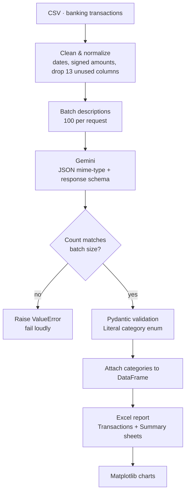
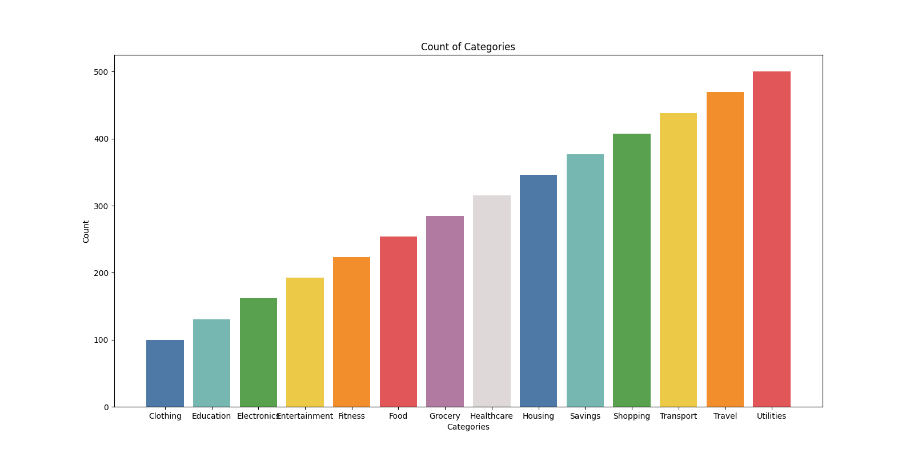
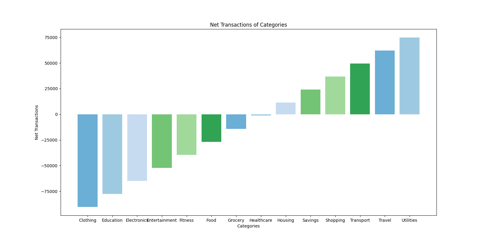

# AI Finance Expense Categorizer

Classifies raw banking transactions into spending categories using **Gemini**, validates every response against a strict schema, and exports a multi-sheet Excel report with charts.


---

## The problem

Bank statements arrive as unstructured free text — `"UBER *TRIP 8XK2P"`, `"SQ *COFFEE ROASTERS"`, `"ACH DEBIT CONEDISON"`. Categorizing thousands of these by hand is tedious; asking an LLM to do it naively is unreliable. This pipeline makes the LLM's output **structurally guaranteed** rather than hoped-for.

---

## Pipeline



---

## Reliability design

Three independent guards stop bad model output from reaching the report:

| Guard | Mechanism | Catches |
|---|---|---|
| **Schema enforcement** | `response_schema` + `response_mime_type="application/json"` sent to Gemini | Free-text or malformed JSON |
| **Closed vocabulary** | Pydantic `Literal` of 14 allowed categories | Invented categories like `"Misc"` |
| **Count assertion** | Explicit check that `len(categories) == len(batch)` | Silent row misalignment — the dangerous failure |

That third guard matters most. If the model returns 99 categories for 100 transactions, every subsequent row would be labelled with its neighbour's category. The pipeline raises instead of writing a plausible-looking, entirely wrong report.

### Retry policy

| Status | Class | Behaviour |
|---|---|---|
| `429`, `500`, `502`, `503`, `504` | `RetryableError` | Exponential backoff (4s → 60s), up to 15 attempts |
| `400`–`499` (other) | `NonRetryableError` | Fails immediately — retrying a bad request wastes quota |

### Why batches of 100

Sending all transactions at once invites truncation and drift; sending them one at a time is slow and expensive. Batching at 100 keeps each request inside a reliable context window while cutting API calls by two orders of magnitude.

---

## Categories

```
Food · Grocery · Transport · Travel · Utilities · Shopping · Clothing
Electronics · Healthcare · Fitness · Education · Housing
Entertainment · Savings
```

Defined as a `Literal` type, so the schema itself prevents anything outside this list.

---

## Output

The pipeline writes `report.xlsx` with two sheets:

| Sheet | Contents |
|---|---|
| **Transactions** | Every transaction with its assigned category |
| **Summary** | Per-category transaction count and net amount |

Plus two charts:

**Transaction count by category**



**Net amount by category**



> Debit transactions are negated during cleaning, so "net amount" reflects real cash flow direction rather than raw magnitude.

---

## Getting Started

```bash
git clone https://github.com/rehaannazir/AI-Finance-Expense-Categorizer.git
cd AI-Finance-Expense-Categorizer

python -m venv venv
source venv/bin/activate      # Windows: venv\Scripts\activate

pip install pandas numpy matplotlib google-genai pydantic tenacity openpyxl python-dotenv
```

Create a `.env` file:

```env
GEMINI_API_KEY=your-gemini-api-key
```

Run it:

```bash
cd code
python main.py
```

---

## Project structure

```
.
├── code/main.py        # Full pipeline: clean → categorize → validate → report
├── data/               # Source CSV (USA banking transactions, 2023–2024)
├── output_data/        # Generated report.xlsx
└── charts/             # Generated PNG charts
```

---

## Using your own data

The script expects a CSV containing at least:

| Column | Purpose |
|---|---|
| `Transaction_Description` | The text sent to the model for classification |
| `Transaction_Date` | Parsed to datetime |
| `Transaction_Type` | `Debit` rows have their amount negated |
| `Transaction_Amount` | Aggregated in the summary |

Adjust the `un_necessary_cols` list in `main.py` to match your schema.

---

## Tech Stack

| Concern | Tool |
|---|---|
| Model | Gemini (`google-genai`) with structured output + thinking config |
| Validation | Pydantic — `Literal` enum, `model_validate_json` |
| Data | pandas · NumPy |
| Retries | Tenacity — exponential backoff, typed exception filtering |
| Reporting | openpyxl (multi-sheet Excel) · Matplotlib |
| Config | python-dotenv |
